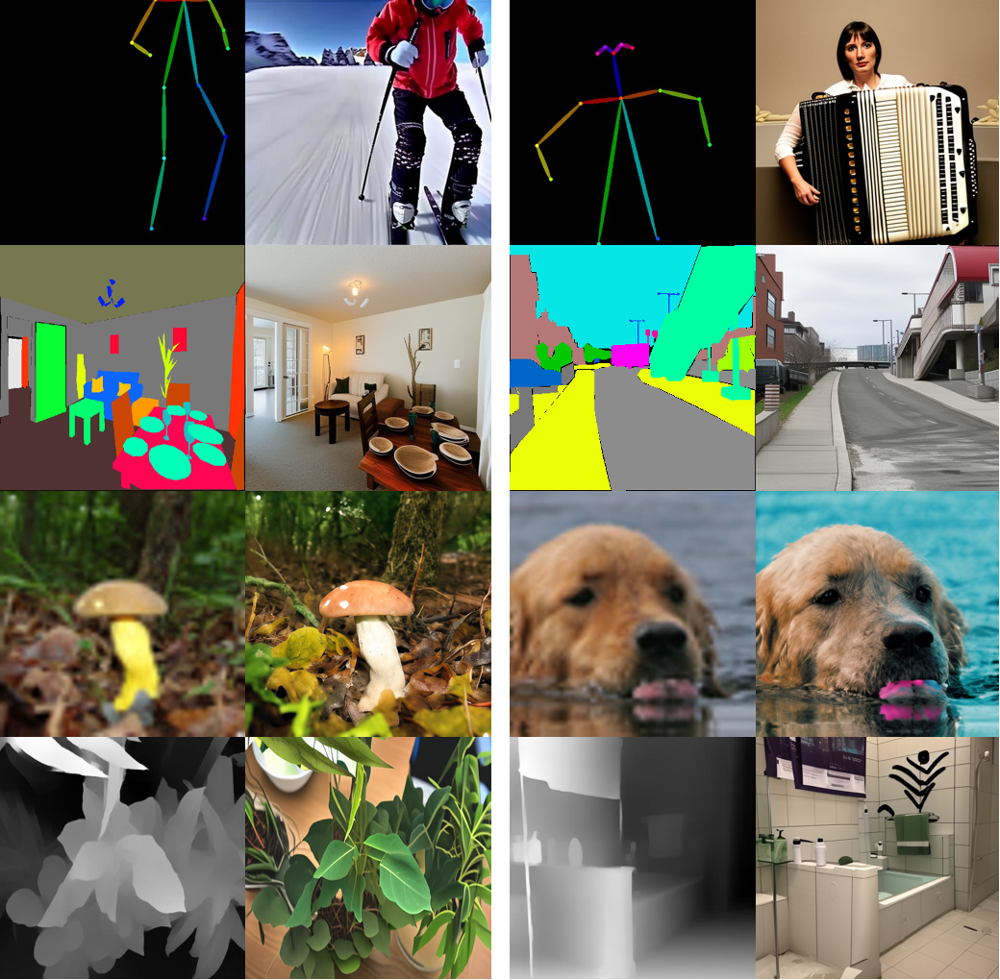
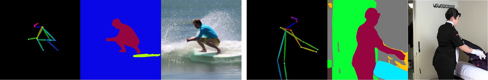
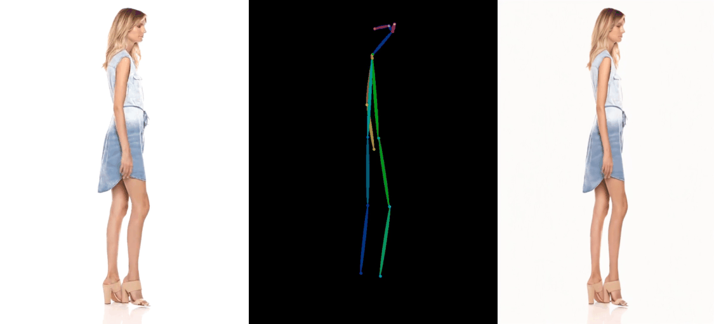

<!-- <h1 align="center">Coarse-guided-Gen</h1> -->
<h2 align="center">LISA: Likelihood Score Alignment for Visual-condition Controllable Generation</h2>
<p align="center">
  <a href="https://wang-yanghao.github.io/">Yanghao Wang</a> ·
  Hongxu Chen ·
  Jiazhen Liu ·
  Zhenqi He ·
  Rui Liu ·
  Zhen Wang ·
  Long Chen<sup>†</sup>
</p>

<p align="center">
  <a href="https://arxiv.org/pdf/2603.12057">
    
  </a>
</p>

<!-- <h4 align="center">Image Restoration</h4>

<p align="center">

</p>


<h4 align="center">Image Editing</h4>

<p align="center">

</p>

<h4 align="center">Camera-controlled Video Generation</h4>
  <br/>
  <br/>


<h3 align="center">Achieve various conditional visual generation guided by a coarse sample with 1 line of code.</h3> -->


<!-- ## Abstract
We propose a novel guided method by using the $h$-transform, a tool that can constrain the sampling process under desired conditions. Specifically, we modify the transition probability at each sampling timestep by adding to the original differential equation with a drift function, which approximately steers the generation toward the ideal fine sample. To address unavoidable approximation errors, we introduce a noise-level-aware schedule that gradually de-weights the term as the error increases, ensuring both guidance adherence and high-quality synthesis. -->

<br>

<!-- ## 0. Table of Contents

- [Environment preparation](#1-environment-preparation)
- [Training](#2-quick-start)
    - [Coarse image guided generation](#coarse-image-guided-generation)
    - [Coarse video guided generation](#coarse-video-guided-generation)
- [Full run](#3-full-run-complete-datasets-and-evaluation)
  - [Coarse image guided generation](#coarse-image-guided-generation-1)
  - [Coarse video guided generation](#coarse-video-guided-generation-1)
- [TODO](#todo-🛠️)
- [Acknowledgments](#acknowledgments)
- [BibTeX](#bibtex) -->

<br>

## 1. Environment preparation
```
pip install -r requirements.txt
```
  

<br>

## 2. Training

We take the pose-guided image generation task as the example, you can change the dataset name for other tasks.

```
export SPLIT="val"
export DATASET_NAME="Luka-Wang/realsinglehumanpose"
export CONTROLNET_DIR="model_out/realsinglehumanpose/"

accelerate launch --config_file "./config.yml" \
 --main_process_port=23156 ./train_controlnet_lisa.py \
 --pretrained_model_name_or_path="Manojb/stable-diffusion-2-1-base" \
 --output_dir=$CONTROLNET_DIR \
 --dataset_name=$DATASET_NAME \
 --resolution=512 \
 --learning_rate=1e-5 \
 --validation_image "log_val/realsinglehumanpose/1.png" "log_val/realsinglehumanpose/2.png" \
 --validation_prompt "a photo of a woman in a purple tank top is rowing a boat" "a photo of a man in a boat holding a fishing rod" \
 --train_batch_size=8 \
 --gradient_accumulation_steps=4 \
 --max_train_steps=10000 \
 --gradient_checkpointing \
 --checkpointing_steps=500 \
 --validation_steps=500 \
 --dataloader_num_workers=32 \
 --weight_lambda=0.2 \
 --decoder_feature_source=down_5 \
```


<br>


## 3. Inference and Evaluation

```
export CONTROLNET_DIR="model_out/realsinglehumanpose/checkpoint-10000/controlnet"
python inference.py \
 --dataset_split=$SPLIT \
 --pretrained_model_name_or_path="Manojb/stable-diffusion-2-1-base" \
 --controlnet_model_name_or_path=$CONTROLNET_DIR \
 --dataset_name=$DATASET_NAME \
 --resolution=512 \
 --output_dir="${CONTROLNET_DIR}/outputs/${SPLIT}/" \

python ./eval_scripts/metrics_realpose.py \
 --dataset_split=$SPLIT \
 --controlnet_model_name_or_path=$CONTROLNET_DIR \
 --dataset_name=$DATASET_NAME \
```


<br>


## TODO 🛠️

- [x] Controllable Image Gneration using SD2.1 run code
- [ ] Controllable Image Gneration using SD3 run code
- [ ] Controllable Video Gneration using SVD run code


<br>


## BibTex
```
```
